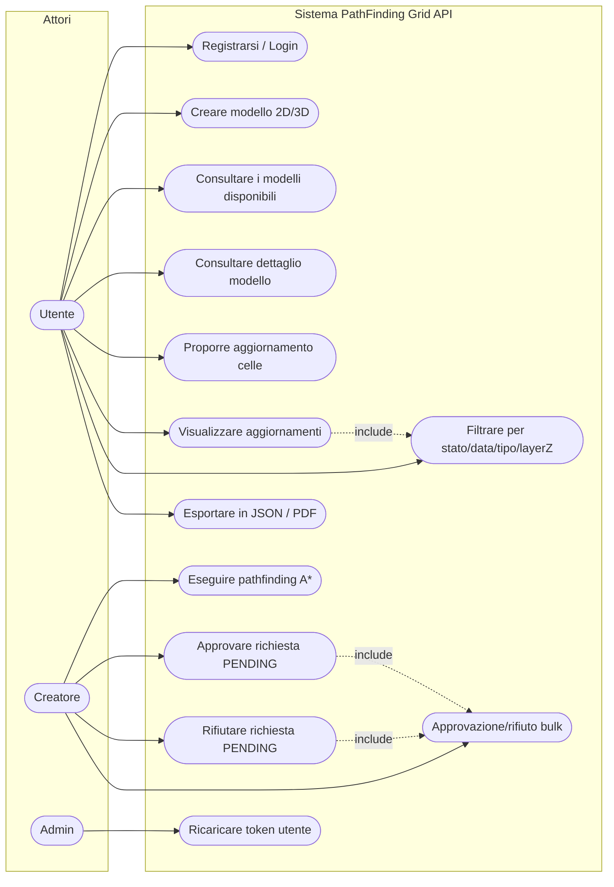
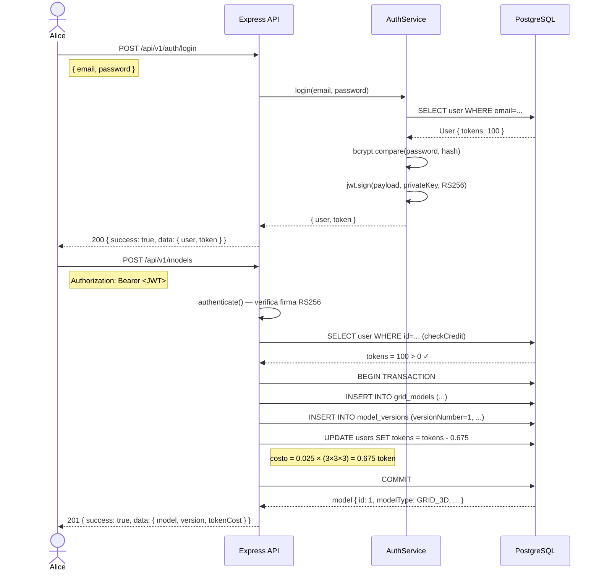
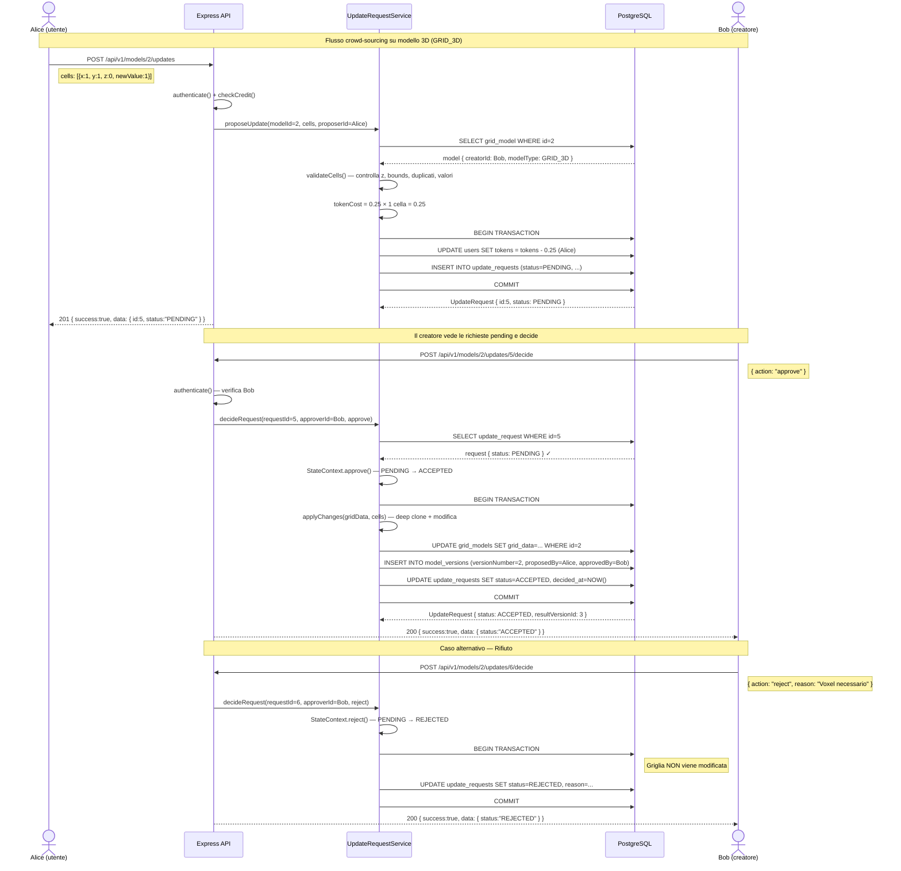
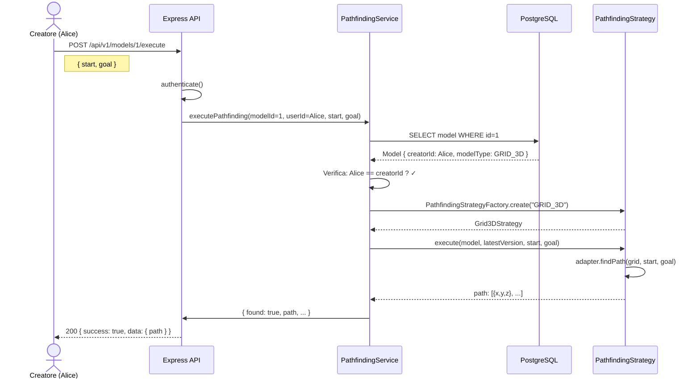
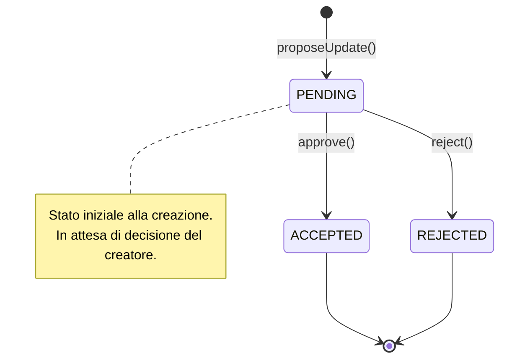
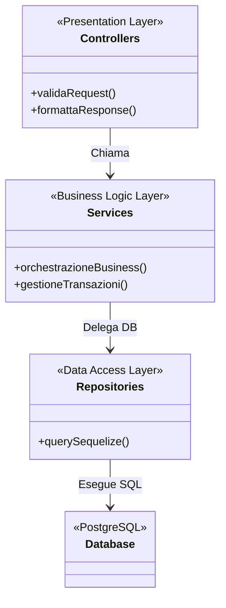

# PathFinding Grid API

> **Progetto per il corso di Programmazione Avanzata – A.A. 2025/2026**  
> Università Politecnica delle Marche – Docente: Prof. Adriano Mancini

**Dettagli Consegna:**
- **URL Repository Pubblico:** [Inserisci qui l'URL del repository GitHub]
- **Commit ID:** [Inserisci qui il commit ID per la valutazione]
- **Data Esame:** [Inserisci qui la data dell'esame]

Back-end per la gestione, validazione, esecuzione e versionamento di modelli di ricerca del percorso su griglia, con supporto sia per griglie 2D che per voxel-grid 3D.

---

## Obiettivo del Progetto

Il sistema realizza una piattaforma **crowd-sourcing** per la gestione di mappe di navigazione (griglie/voxel-grid). Gli utenti possono:

- **Creare** modelli di griglia (2D o 3D) pagando in token
- **Proporre** modifiche all'occupazione delle celle (0=libero, 1=occupato)
- **Approvare o rifiutare** le modifiche proposte da altri (solo il creatore)
- **Eseguire** l'algoritmo di pathfinding A* su un modello
- **Esportare** lo storico degli aggiornamenti in JSON o PDF

---

## Dettagli delle Richieste

### Endpoint API

#### Autenticazione (pubblici)
| Metodo | Endpoint | Descrizione |
|--------|----------|-------------|
| POST | `/api/v1/auth/register` | Registra un nuovo utente |
| POST | `/api/v1/auth/login` | Login e ottieni il JWT |

#### Modelli di Griglia (JWT richiesto)
| Metodo | Endpoint | Descrizione |
|--------|----------|-------------|
| POST | `/api/v1/models` | Crea modello (costa token) |
| GET | `/api/v1/models` | Lista modelli |
| GET | `/api/v1/models/:id` | Dettaglio modello |

#### Aggiornamenti (JWT richiesto)
| Metodo | Endpoint | Descrizione |
|--------|----------|-------------|
| POST | `/api/v1/models/:id/updates` | Proponi aggiornamento |
| GET | `/api/v1/models/:id/updates` | Lista aggiornamenti (JSON o PDF) |
| POST | `/api/v1/models/:id/updates/bulk-decide` | Approva/rifiuta in bulk |
| POST | `/api/v1/models/:id/updates/:reqId/decide` | Approva/rifiuta singola richiesta |

#### Utenti
| Metodo | Endpoint | Descrizione |
|--------|----------|-------------|
| GET | `/api/v1/users` | Lista utenti (pubblico) |
| GET | `/api/v1/users/:id` | Dettaglio utente (pubblico) |
| POST | `/api/v1/users` | Crea utente (pubblico) |
| PUT | `/api/v1/users/:id` | Aggiorna utente (JWT richiesto) |
| DELETE | `/api/v1/users/:id` | Elimina utente (JWT richiesto, admin) |
| POST | `/api/v1/users/:id/recharge` | Ricarica token (JWT richiesto, admin) |

#### Pathfinding (JWT richiesto, solo creatore)
| Metodo | Endpoint | Descrizione |
|--------|----------|-------------|
| POST | `/api/v1/models/:id/execute` | Esegui pathfinding |

### Esempi di Chiamate API

#### 1. Registrazione

```bash
curl -X POST http://localhost:3000/api/v1/auth/register \
  -H "Content-Type: application/json" \
  -d '{
    "name": "Alice Rossi",
    "email": "alice@example.it",
    "password": "Password123!"
  }'
```

#### 2. Creazione Modello GRID_3D

```bash
curl -X POST http://localhost:3000/api/v1/models \
  -H "Authorization: Bearer <TOKEN>" \
  -H "Content-Type: application/json" \
  -d '{
    "name": "Edificio 3 Piani",
    "modelType": "GRID_3D",
    "width": 4, "height": 4, "depth": 3,
    "gridData": [
      [[0,0,0,0],[0,1,0,0],[0,0,0,0],[0,0,0,0]],
      [[0,0,0,0],[0,0,0,0],[0,0,1,0],[0,0,0,0]],
      [[0,0,0,0],[0,0,0,0],[0,0,0,0],[0,0,0,0]]
    ]
  }'
```

#### 3. Proposta Aggiornamento 3D

```bash
curl -X POST http://localhost:3000/api/v1/models/1/updates \
  -H "Authorization: Bearer <TOKEN>" \
  -H "Content-Type: application/json" \
  -d '{
    "cells": [
      { "x": 2, "y": 2, "z": 1, "newValue": 1 }
    ]
  }'
```

#### 4. Esecuzione Pathfinding 3D

```bash
curl -X POST http://localhost:3000/api/v1/models/1/execute \
  -H "Authorization: Bearer <TOKEN>" \
  -H "Content-Type: application/json" \
  -d '{
    "start": { "x": 0, "y": 0, "z": 0 },
    "goal":  { "x": 3, "y": 3, "z": 2 }
  }'
```

#### 5. Export PDF

```bash
curl -X GET "http://localhost:3000/api/v1/models/1/updates?format=pdf&status=ACCEPTED" \
  -H "Authorization: Bearer <TOKEN>" \
  --output updates.pdf
```

#### 6. Ricaricare token utente (solo admin)

```bash
curl -X POST http://localhost:3000/api/v1/users/2/recharge \
  -H "Authorization: Bearer <ADMIN_TOKEN>" \
  -H "Content-Type: application/json" \
  -d '{
    "amount": 50
  }'
```

### Errori Gestiti

| Scenario | HTTP Status |
|---|---|
| Token JWT mancante o malformato | `401 Unauthorized` |
| Credito esaurito | `401 Unauthorized` |
| Permessi insufficienti (non creatore) | `403 Forbidden` |
| Modello non trovato | `404 Not Found` |
| Coordinate fuori griglia | `400 Bad Request` |
| Celle duplicate nella richiesta | `400 Bad Request` |
| Modifica nulla (cella già nello stato proposto) | `400 Bad Request` |
| Richiesta già in stato ACCEPTED o REJECTED | `409 Conflict` |
| Path non trovato | `200 OK` con `found: false` |

---

## Progettazione - UML

### Architettura a Strati

```
HTTP Request
     │
     ▼
┌─────────────┐
│  Middleware │  ← authenticate (JWT RS256), checkCredit, requireAdmin, errorHandler
└──────┬──────┘
       │
       ▼
┌─────────────┐
│   Router    │  ← /api/v1/auth, /models, /models/:id/updates, /models/:id/execute
└──────┬──────┘
       │
       ▼
┌─────────────┐
│ Controller  │  ← valida input, delega al service, formatta risposta HTTP
└──────┬──────┘
       │
       ▼
┌─────────────┐
│   Service   │  ← logica di business, calcolo token, orchestrazione transazioni
└──────┬──────┘
       │
       ▼
┌─────────────┐
│ Repository  │  ← query Sequelize (solo qui si tocca il DB)
└──────┬──────┘
       │
       ▼
┌─────────────┐
│  Database   │  ← PostgreSQL
└──────┬──────┘
```

### Modello Dati

```
┌──────────────┐     ┌──────────────────┐     ┌──────────────────┐
│    users     │     │   grid_models    │     │  model_versions  │
│──────────────│     │──────────────────│     │──────────────────│
│ id (PK)      │─┐   │ id (PK)          │─┐   │ id (PK)          │
│ name         │ │   │ name             │ │   │ model_id (FK)    │
│ email        │ │   │ model_type       │ │   │ version_number   │
│ password     │ │   │ width            │ │   │ grid_data (JSON) │
│ role         │ │   │ height           │ │   │ proposed_by (FK) │
│ tokens       │ │   │ depth            │ │   │ approved_by (FK) │
│ is_active    │ │   │ grid_data (JSON) │ │   │ created_at       │
│ created_at   │ └──│ creator_id (FK)  │ │   └──────────────────┘
│ updated_at   │     │ created_at       │ │
└──────────────┘     │ updated_at       │ │   ┌──────────────────────┐
                     └──────────────────┘ │   │   update_requests    │
                                          │   │──────────────────────│
                                          └──│ model_id (FK)        │
                                              │ base_version_id (FK) │
                                              │ result_version_id    │
                                              │ proposer_id (FK)     │
                                              │ approver_id (FK)     │
                                              │ cells (JSON)         │
                                              │ status (ENUM)        │
                                              │ reason               │
                                              │ requested_at         │
                                              │ decided_at           │
                                              └──────────────────────┘
```

### Diagramma UML – Casi d'Uso



### Diagramma di Interazione Globale (Interaction Overview)

```mermaid
flowchart TD
    Start((Inizio)) --> Login[Login / Ricezione JWT]
    Login --> API_Call{Chiamata API Protetta}
    
    API_Call --> Auth{Verifica JWT}
    Auth -- Valido --> Router[Router / Dispatcher]
    Auth -- Non Valido --> Err401[401 Unauthorized]
    
    Router --> |POST /models| Create[Creazione Modello]
    Create --> CheckCred1{Credito Sufficiente?}
    CheckCred1 -- Si --> DB1[(Salvataggio Modello e Versione 1)]
    CheckCred1 -- No --> ErrCred[401 Credito Insufficiente]
    
    Router --> |POST /updates| Update[Proposta Aggiornamento]
    Update --> CheckCred2{Credito Sufficiente?}
    CheckCred2 -- Si --> IsCreator{Proponente == Creatore?}
    CheckCred2 -- No --> ErrCred
    IsCreator -- Si --> DB2[(Stato ACCEPTED + Nuova Versione)]
    IsCreator -- No --> DB3[(Stato PENDING)]
    
    Router --> |POST /decide| Decide[Decisione Aggiornamento]
    Decide --> IsAppr{Utente == Creatore?}
    IsAppr -- Si --> Apply[Applica Modifiche (Approve/Reject)]
    IsAppr -- No --> Err403[403 Forbidden]
    
    Router --> |POST /execute| Path[Esecuzione Pathfinding]
    Path --> IsPathCr{Utente == Creatore?}
    IsPathCr -- Si --> RunAStar[A* Strategy Adapter su Versione Attuale]
    IsPathCr -- No --> Err403
```

### Diagramma di Sequenza – Login e Creazione Modello 3D



### Diagramma di Sequenza – Aggiornamento 3D con Approvazione/Rifiuto



### Diagramma di Sequenza – Esecuzione Pathfinding



### Diagramma a Stati – Macchina a Stati per le Update Requests



### Diagramma delle Classi – Pattern Architetturali



---

## Progettazione - Pattern

### 1. Repository Pattern
**File:** `src/repositories/`

Isola completamente l'accesso ai dati tramite Sequelize. I service non conoscono Sequelize; usano solo l'interfaccia del repository.

```typescript
// Il service chiama il repository, non Sequelize direttamente
const model = await gridModelRepository.findByIdWithDetails(modelId);
```

### 2. Service Layer Pattern
**File:** `src/services/`

Separa la logica applicativa (calcolo token, orchestrazione transazioni, versionamento) dai controller Express e dai repository.

```typescript
// Il service gestisce la transazione completa
return sequelize.transaction(async (t) => {
  await userRepository.decrementTokens(userId, tokenCost, t);
  const result = await gridModelRepository.createWithFirstVersion(data, t);
  return result;
});
```

### 3. Strategy Pattern
**File:** `src/strategies/pathfinding.strategy.ts`

Seleziona l'algoritmo di pathfinding a runtime in base al tipo di modello.

```typescript
// La factory sceglie la strategia corretta
const strategy = PathfindingStrategyFactory.create(model.modelType);
// Grid2DStrategy per GRID_2D, Grid3DStrategy per GRID_3D
const result = strategy.execute(model, version, start, goal);
```

### 4. Adapter Pattern
**File:** `src/adapters/pathfinding.adapter.ts`

Incapsula PathFinding3D.js (libreria JS senza tipi) dietro un'interfaccia TypeScript pulita. Se la libreria non è installata, usa un'implementazione A* fallback interna.

```typescript
export interface IPathfindingAdapter {
  findPath(grid: AdapterGrid, start: Coordinate3D, goal: Coordinate3D): PathfindingAdapterResult;
}
```

### 5. State Pattern
**File:** `src/states/update-request.state.ts`

Gestisce le transizioni di stato delle richieste di aggiornamento (PENDING → ACCEPTED | REJECTED) impedendo transizioni non valide.

```typescript
const ctx = new UpdateRequestStateContext(UpdateRequestStatus.PENDING);
ctx.approve(); // ok: PENDING → ACCEPTED
ctx.reject();  // lancia AppError: già in stato ACCEPTED
```

---

## Avvio del Servizio

### Con Docker (consigliato)

```bash
# 1. Copia il file .env e configura le variabili
cp .env.example .env

# 2. Genera le chiavi RSA per JWT RS256
openssl genrsa -out private.pem 2048
openssl rsa -in private.pem -pubout -out public.pem

# 3. Incolla le chiavi nel .env (su una riga con \n)
# Vedi .env.example per le istruzioni

# 4. Avvia l'applicazione e il database
docker-compose up --build

# 5. (Opzionale) Esegui il seed con i dati di demo
docker-compose exec app npm run db:seed
```

L'API sarà disponibile su `http://localhost:3000`

### In Locale (senza Docker)

```bash
# 1. Installa le dipendenze
npm install

# 2. Avvia PostgreSQL e configura il .env

# 3. Avvia in modalità sviluppo
npm run dev
```

---

## Test del Progetto

É possibile eseguire una serie di test predefiniti importando all'interno di Postman la collection situata all'interno della root directory di tale repository.

Inoltre, il progetto include una suite di test automatizzati (Jest) che verifica i casi d'uso principali e i vincoli di sicurezza:

```bash
# Installa le dipendenze
npm install

# Esegui tutti i test e verifica l'output
npm test
```

| Suite di Test | Cosa verifica |
|---|---|
| `auth.middleware.test.ts` | Sicurezza JWT, validazione firme, controlli sul credito residuo. |
| `update-request.middleware.test.ts` | Vincoli di business: autorizzazione creatore, validazione coordinate 3D, controllo duplicati. |
| `users.test.ts` | Health check, registrazione e login, vincoli di unicità email. |
| `integration.test.ts` | Esecuzione del pathfinding 3D, rollback DB su errori, transazioni Bulk. |

*Nota: I test usano **SQLite in memoria** (`NODE_ENV=test`) e non richiedono un database PostgreSQL.*

---

## Note

### Stack Tecnologico

| Componente | Tecnologia |
|---|---|
| Runtime | Node.js 20 |
| Framework | Express.js 4 |
| Linguaggio | TypeScript 5 |
| ORM | Sequelize 6 + sequelize-typescript |
| Database | PostgreSQL (SQLite in test) |
| Autenticazione | JWT RS256 (`jsonwebtoken`) |
| Password hashing | bcrypt |
| Pathfinding | PathFinding3D.js (via Adapter) + A\* fallback |
| Export PDF | PDFKit |
| Test | Jest + Supertest |
| Container | Docker + Docker Compose |
| Logging | Winston |

### Struttura del Progetto

```
src/
├── adapters/
│   └── pathfinding.adapter.ts    # Adapter Pattern – PathFinding3D.js
├── config/
│   ├── database.ts               # Sequelize (PostgreSQL + SQLite test)
│   ├── env.ts                    # Variabili d'ambiente tipizzate
│   └── logger.ts                 # Winston logger
├── controllers/
│   ├── auth.controller.ts
│   ├── grid-model.controller.ts
│   ├── update-request.controller.ts
│   └── pathfinding.controller.ts
├── middleware/
│   ├── auth.middleware.ts         # JWT RS256 + checkCredit + requireAdmin
│   ├── error.middleware.ts        # Global error handler
│   └── logger.middleware.ts
├── models/
│   ├── user.model.ts
│   ├── grid-model.model.ts
│   ├── model-version.model.ts
│   ├── update-request.model.ts
│   └── index.ts
├── repositories/
│   ├── base.repository.ts         # CRUD generico
│   ├── user.repository.ts
│   ├── grid-model.repository.ts
│   ├── model-version.repository.ts
│   └── update-request.repository.ts
├── routes/
│   ├── index.ts                   # Root router
│   ├── auth.routes.ts
│   ├── grid-model.routes.ts
│   ├── update-request.routes.ts
│   └── pathfinding.routes.ts
├── seeds/
│   └── seed.ts                    # Dati di demo
├── services/
│   ├── auth.service.ts            # Register, login, JWT
│   ├── grid-model.service.ts      # Creazione + validazione griglia
│   ├── update-request.service.ts  # Crowd-sourcing + transazioni
│   ├── pathfinding.service.ts     # Orchestrazione A*
│   └── export.service.ts          # JSON + PDF
├── states/
│   └── update-request.state.ts   # State Pattern
├── strategies/
│   └── pathfinding.strategy.ts   # Strategy Pattern (2D/3D)
├── types/
│   ├── common.ts                  # Enum, interfacce, tipi condivisi
│   └── express.d.ts               # Estensioni Express
├── app.ts
└── server.ts
tests/
├── auth.middleware.test.ts
├── integration.test.ts
├── update-request.middleware.test.ts
└── users.test.ts
```


---

## Autori

- **Luca Belardinelli**
- **Luigi Greco**
